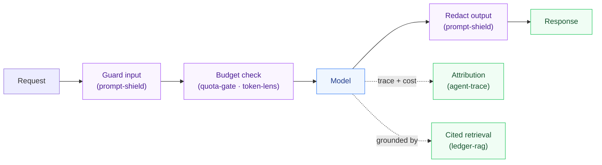

# Hi, I'm Parag 👋

**AI / backend engineer.** I build the deterministic control plane *around* large
language models — the layer that decides whether a model is safe to ship, cheap to
run, grounded in real evidence, and hard to break.

> My one design rule, in every agent I ship: **the model proposes; deterministic,
> tested code validates and executes.** The interesting engineering isn't the
> prompt — it's the guardrail the prompt can't talk its way past.

**44 repos · 1,140+ tests green in CI · 14 live demos · cores in 7 languages · 8 with reproducible benchmarks**

&nbsp;

> **Open to Senior / Staff AI-engineering roles** — agents, RAG, and LLM infrastructure.

  
  

<b>Click either image for the live demo.</b> Left: <a href="https://parag-labs.github.io/agentforge-dashboard/">AgentForge</a> agent-fleet cockpit. Right: <a href="https://parag-labs.github.io/agent-trace/">agent-trace</a> run inspector with a cost/budget gate.

I'm a Senior Software Engineer at Microsoft, and on nights and weekends I build
small, tested tools for the unglamorous parts of putting AI in production.
Everything below is real code with a README that explains the *why*, tests that
assert the hard part, and — where it earns one — a design doc with trade-offs and
reproducible benchmarks.

### At Microsoft (2018–present)

Production AI and platform work at scale — the day job behind the side projects:

- **Copilot Studio** — shipped an in-house AI agent (Workflows Agents) into Microsoft
  365 Copilot, leading the First Run Experience squad; re-architected a large
  enterprise service into distributed microservices and built the reverse-proxy layer
  routing between customer-managed and data planes — systems used globally at
  enterprise scale.
- **Azure Approvals** — built three production AI agents on the team: an **E2E failure-
  triage agent** that auto-diagnoses failed pipeline runs and files bugs (turning hours
  of manual triage into minutes), a PR review & security agent, and a **RAG** architecture
  knowledge agent with citation-backed answers across repos and specs.
- **Copilot for Finance** — greenfield microservices (telemetry, metadata store, auth),
  RESTful APIs, App Store publication, and CI/CD automation for faster, more frequent
  releases.

### Start here

**[llm-in-production](https://github.com/parag-labs/llm-in-production)** — field
notes on the seven things that will bite an LLM feature in production (cost, evals,
prompt injection, drift, grounding, rate limits, agent guardrails), each with the
pattern that fixes it and the small tool that implements it. If you read one thing,
read its pre-launch checklist.

The whole model of how these fit on the request path:

### What I focus on

- **Agents that do real work, safely** — planner/executor splits with a policy gate
  and human-in-the-loop approval: [operations-agent](https://github.com/parag-labs/operations-agent),
  [incident-commander](https://github.com/parag-labs/incident-commander) (Go),
  [agent-guard](https://github.com/parag-labs/agent-guard) (zero-trust tool sandbox),
  [guardianforge](https://github.com/parag-labs/guardianforge) (fleet governance, Go + C#).
- **Grounded retrieval** — RAG you can prove: [ledger-rag](https://github.com/parag-labs/ledger-rag)
  ships a tamper-evident proof with every answer;
  [knowledge-workspace](https://github.com/parag-labs/knowledge-workspace) cites every claim;
  [repo-index](https://github.com/parag-labs/repo-index) turns any repo into a citable knowledge
  base and answers only from retrieved source.
- **Ship-it discipline** — [eval-forge](https://github.com/parag-labs/eval-forge) (CI eval gate),
  [prompt-shield](https://github.com/parag-labs/prompt-shield) (injection in / PII out),
  [token-lens](https://github.com/parag-labs/token-lens) (cost attribution),
  [quota-gate](https://github.com/parag-labs/quota-gate) (per-tenant budgets),
  [drift-watch](https://github.com/parag-labs/drift-watch) (PSI/KL drift).
- **Systems underneath** — consensus and correctness: [coracle](https://github.com/parag-labs/coracle)
  (Raft) + [flotilla](https://github.com/parag-labs/flotilla) (thousands of groups on one node),
  [deterministic-sim-testing](https://github.com/parag-labs/deterministic-sim-testing),
  [durable-execution](https://github.com/parag-labs/durable-execution).
- **Model internals & LLM correctness** — [spec-decode](https://github.com/parag-labs/spec-decode)
  implements speculative decoding from scratch and *proves* it's exact (the emitted
  distribution provably equals sampling the target), with honest speedup benchmarks;
  [metamorph](https://github.com/parag-labs/metamorph) is metamorphic testing for LLMs —
  invariance under paraphrase, reorder, and negation, shrinking each failure to a minimal prompt;
  [honest-transformer](https://github.com/parag-labs/honest-transformer) is a transformer forward
  pass with **bit-identical logits across Python, C#, and Java**; and
  [batch-invariant](https://github.com/parag-labs/batch-invariant) shows — and fixes — the
  reduction-order bug that makes a decoded token depend on its batch-mates.
- **On-device AI & interfaces** — ten Flutter apps with tested, deterministic cores,
  each with a live demo (on-device intelligence, health, privacy, adaptive UI).

### Featured work

| Project | What it is | | CI |
|---|---|---|---|
| **[agent-trace](https://github.com/parag-labs/agent-trace)** | visual timeline + replay for agent runs — where a run spent time, tokens, and money, then diff two runs | [▶ demo](https://parag-labs.github.io/agent-trace/) |  |
| **[agentforge-dashboard](https://github.com/parag-labs/agentforge-dashboard)** | register, monitor, and deeply compare agents — radar + trade-off insights, spatial agent map | [▶ demo](https://parag-labs.github.io/agentforge-dashboard/) |  |
| **[ledger-rag](https://github.com/parag-labs/ledger-rag)** | verifiable RAG — every answer ships a tamper-evident cryptographic proof (Python/C#/Java) | |  |
| **[agent-guard](https://github.com/parag-labs/agent-guard)** | zero-trust runtime sandbox for tool-calling agents: least-privilege policy + signed audit log | |  |
| **[infra-optimizer](https://github.com/parag-labs/infra-optimizer)** | AI infra optimizer in Rust — the model only picks among candidates Rust has already proven safe | |  |
| **[gpu-flock](https://github.com/parag-labs/gpu-flock)** | a few thousand boids flocking entirely on the GPU with WebGPU compute shaders | [▶ demo](https://parag-labs.github.io/gpu-flock/) |  |

More — 44 focused projects, 14 live demos — under **[parag-labs](https://github.com/parag-labs)**.

### A deep-dive: verifiable RAG

Most RAG systems ask you to *trust* that an answer came from your corpus.
**[ledger-rag](https://github.com/parag-labs/ledger-rag)** makes it checkable: every
retrieved chunk is a leaf in a Merkle tree, and each answer ships an **inclusion
proof** binding it to a signed root — so a third party can verify the evidence set
wasn't altered after the fact, without re-reading the corpus. The design doc owns the
boundary honestly (*"tamper-evident ≠ tamper-proof"*, the way certificate transparency
does), and the same core is written three times — Python, C#, Java — so the property
is the property, not a trick of one language's crypto library.

### Measured, not asserted

Where performance is a claim, there's a committed script and a graph. Example — why
consistent hashing instead of `hash % N`, from
[consistent-hash](https://github.com/parag-labs/consistent-hash):

Adding a node to a 64-node cluster remaps **~1%** of keys with a consistent-hash ring;
plain `hash % N` remaps **~98.5%** — nearly the entire keyspace, every time. Eight
repos ship a `BENCHMARKS.md` like this, measured on a plain machine from a script you
can re-run.

### On writing cores three times

A lot of the cores are written in Python, **and** C#, **and** Java. That's not for
show: they're plain algorithms (a Merkle proof, a point-in-time join, a drift
statistic), and porting them keeps me honest that the logic is the logic — not a
trick of one language's libraries.

Outside the org I also maintain **[flatwire](https://github.com/flatwire-io/flatwire)** —
streaming serialization with one identical API across six languages, published to
every major registry:

### Reach me

- 🧰 Backend · distributed systems · applied cryptography · LLM & agent tooling
- ☁️ Azure (AKS, Container Apps, Cosmos DB), Docker/Kubernetes, CI/CD
- 💬 [linkedin.com/in/paragsawant](https://www.linkedin.com/in/paragsawant/)
